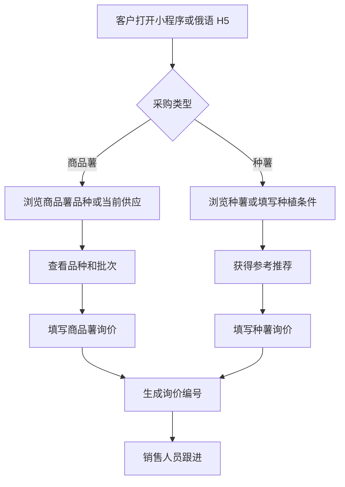
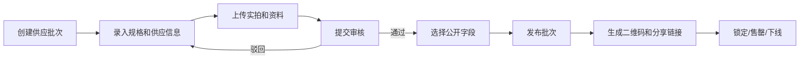
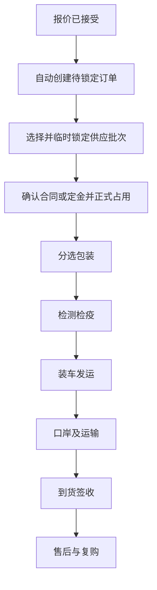

# 03 用户角色与业务流程

## 1. 外部用户

| 角色 | 目标 | 主要操作 |
|---|---|---|
| 商品薯采购商 | 找到符合销售或加工要求的货源 | 浏览、筛选、询价、看批次、看订单 |
| 种薯采购商 | 找到适合当地条件的种薯 | 填写种植条件、选品、询价、查看检测和订单 |
| 采购商协作人员 | 协助确认规格或交付 | 通过授权链接查看报价、批次或订单 |
| 微信访客 | 了解企业并转发内容 | 浏览和分享，不访问私有交易信息 |

## 2. 内部用户

| 角色 | 职责 |
|---|---|
| 管理人员 | 查看业务数据、分配资源、审批特殊操作 |
| 销售人员 | 跟进询价、维护客户、制作报价、推动订单 |
| 运营编辑 | 管理企业、基地、品种和双语内容 |
| 质量审核人员 | 审核批次、检测报告、证书和公开状态 |
| 物流人员 | 更新装车、口岸、运输和签收节点 |
| 系统管理员 | 用户、权限、配置和系统运维 |

## 3. 外部浏览与询价流程



## 4. 询价到报价流程

1. 客户或销售人员创建询价。
2. 系统检查关键字段是否完整。
3. 询价进入待分配队列。
4. 管理人员或规则分配销售负责人。
5. 销售补充需求并记录沟通情况。
6. 需要时由产品、质量或物流人员协助确认。
7. 销售创建报价版本。
8. 客户接受、拒绝或要求修改。
9. 接受后进入合同和订单阶段；未成交需记录原因。

## 5. 批次发布流程



发布规则：

- 未审核资料不得显示为“已验证”。
- 过期文件需要重新审核或取消公开。
- 批次售罄后保留历史，但停止新询价。
- 修改影响交易的重要字段时需要重新审核或记录原因。

## 6. 报价到订单流程



异常处理：

- 数量不足：重新分配批次或修改报价。
- 质量资料未通过：暂停发运，不向客户显示“已完成”。
- 交期变化：记录原因并通知客户。
- 订单取消：释放未使用库存并保留审计记录。

## 7. 选品助手流程

### 商品薯

```text
选择用途 → 选择上市/交付时间 → 选择规格和处理方式
→ 选择储藏要求 → 推荐品种 → 查看当前供应 → 询价
```

### 种薯

```text
填写种植地区 → 地块与灌溉 → 重茬和病害情况
→ 播种与采收计划 → 目标用途 → 推荐品种
→ 人工复核提示 → 询价
```

## 8. 信息可见性原则

| 信息 | 游客 | 已识别客户 | 负责人销售 | 管理/审核 |
|---|---:|---:|---:|---:|
| 公开品种和基地 | 是 | 是 | 是 | 是 |
| 公开供应状态 | 是 | 是 | 是 | 是 |
| 客户自己的询价 | 否 | 是 | 是 | 是 |
| 其他客户询价 | 否 | 否 | 按权限 | 是 |
| 内部成本和备注 | 否 | 否 | 按权限 | 是 |
| 公开批次资料 | 是 | 是 | 是 | 是 |
| 未审核报告 | 否 | 否 | 按权限 | 是 |
| 客户自己的订单 | 否 | 是 | 是 | 是 |

## 9. 客户身份与访问

- 微信小程序使用微信授权身份。
- 俄语 H5 允许游客浏览和提交询价，不要求先注册。
- 联系人必填，手机或邮箱至少填写一项；Telegram 等渠道作为可选字段。
- 私有报价和订单采用有有效期、不可枚举的安全链接。
- 高敏感内容可要求邮箱验证码或独立查询码二次验证。
- 后台支持根据企业、联系人、手机、邮箱等线索人工合并重复客户，合并操作需留痕。
