# 05 领域数据模型

本文档描述业务领域和关键字段，最终数据库结构在代码仓库技术设计阶段确定。

## 1. 核心关系

```mermaid
erDiagram
    COMPANY ||--o{ BASE : owns
    VARIETY ||--o{ SUPPLY_BATCH : supplied_as
    BASE ||--o{ SUPPLY_BATCH : produces
    SUPPLY_BATCH ||--o{ BATCH_DOCUMENT : has
    CUSTOMER ||--o{ INQUIRY : submits
    INQUIRY ||--o{ QUOTATION : receives
    QUOTATION ||--o| ORDER : converts_to
    ORDER }o--o{ SUPPLY_BATCH : allocates
    ORDER ||--o{ ORDER_EVENT : tracks
    CUSTOMER ||--o{ FOLLOW_UP : has
```

## 2. 企业 Company

- id
- 中文名称、俄文名称
- 企业简介
- 联系方式
- 地址
- 品牌图片
- 状态

## 3. 基地 Base

- id
- 基地名称及俄文名称
- 所在地区
- 基地介绍
- 规模描述及证据来源
- 图片和视频
- 可公开状态

## 4. 品种 Variety

- id
- 中文名称、俄文名称、别名
- 熟期和参考天数
- 外观、植株、内在品质
- 抗病与适应性
- 推荐用途
- 优势和风险
- 种植管理参考
- 商品薯适用标记
- 种薯适用标记
- 内容来源和审核状态
- 发布状态

数值字段应保存单位、来源和适用条件，不能只存一个无法解释的数字。

## 5. 供应批次 SupplyBatch

公共字段：

- id、批次编号
- businessType：商品薯 / 种薯
- varietyId、baseId
- 年份、采收或预计采收时间
- 供应状态
- 可供数量、已锁定数量、计量单位
- 可售数量；由可供数量扣除已锁定数量计算或校验
- 库存公开方式：区间 / 供应状态 / 不公开，不允许公开精确库存
- 包装方式
- 最小采购量
- 预计发货时间
- 公开说明
- 审核和发布状态

价格和精确库存属于内部或指定客户可见信息，不进入公开批次接口。

商品薯扩展字段：

- 商品用途
- 单薯规格和允许偏差
- 水洗或带土
- 新薯或库存货
- 大中薯比例等批次实测信息
- 储藏情况

种薯扩展字段：

- 繁育级别字典项；允许暂未确定，正式名称按证书口径配置
- 脱毒及来源资料
- 种薯规格
- 发芽状态
- 储存条件
- 适宜区域说明
- 品种登记、授权或准入状态

六个首发品种均可关联种薯供应批次。繁育级别字典至少保存中文名称、俄文名称、启用状态、适用证书口径和排序。

## 6. 批次文件 BatchDocument

- id、batchId
- 文件类型
- 中文和俄文名称
- 文件地址和文件哈希
- 签发机构
- 签发和到期时间
- 审核状态
- 审核人、时间和备注
- 是否对客户公开

## 7. 客户 Customer

- id
- 个人或企业类型
- 企业名称
- 联系人
- 国家、地区、城市
- 手机、邮箱及其他联系方式
- 首选语言
- 客户来源
- 客户标签
- 负责人
- 隐私授权记录
- 微信身份标识（仅小程序用户）
- Telegram 等可选联系渠道
- 客户合并关系和操作记录

## 8. 询价 Inquiry

公共字段：

- id、询价编号
- businessType
- customerId
- 来源渠道
- 品种或需要推荐
- 数量和单位
- 交货地点
- 期望交期
- 联系要求
- 负责人
- 状态

商品薯需求字段：用途、规格、水洗状态、包装、储藏要求。

种薯需求字段：种植地区、面积、土壤、灌溉、重茬、播种时间、目标采收时间和所需繁育级别。

## 9. 报价 Quotation

- id、报价编号、版本号
- inquiryId、customerId
- 币种和价格条件
- 报价项目明细
- 包装、交期和交货地点
- 质量与验收说明
- 文件和单证范围
- 有效期
- 状态
- 客户反馈

第一版默认币种为人民币。交付数据需分别保存交货地点、国内段责任方、跨境段责任方和补充约定，不能只用一个“包运输”布尔值表示。

历史版本不可被新版本覆盖。

## 10. 订单 Order

- id、订单编号
- quotationId、customerId
- 合同编号
- 商品明细
- 关联批次及分配数量
- 订单金额和币种
- 交付地点和计划时间
- 当前状态
- 客户查询授权信息

默认模式为基地自提、客户安排跨境运输；可选佳秀农业协助国内段运输至霍尔果斯口岸。

口岸、运输线路和交接地点应引用可维护的字典或路线实体，不能在订单代码中固定为霍尔果斯。

客户查询授权信息至少包含不可枚举的访问令牌、有效期、撤销状态，并预留邮箱验证码或独立查询码二次验证配置。令牌原文不应直接存储。

## 11. 订单节点 OrderEvent

- id、orderId
- 节点类型和状态
- 实际时间
- 中文和俄文说明
- 附件
- 是否客户可见
- 操作人

## 12. 翻译 Translation

对重要业务实体保留：

- 来源语言及原文版本
- 目标语言内容
- 翻译状态
- 翻译人和审核人
- 审核时间

当中文源内容变化时，俄语内容自动回到“待复核”。

## 13. 状态字典

状态字典不得散落在页面代码中。至少集中管理：

- 供应状态
- 询价状态
- 报价状态
- 订单状态
- 资料审核状态
- 翻译状态
- 用户和内容发布状态
