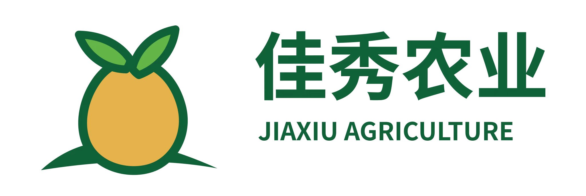
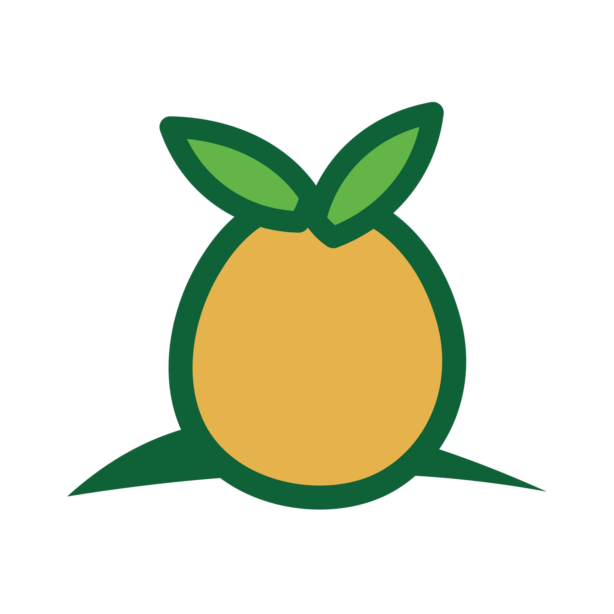

# 10 品牌资产与使用方向

## 1. 品牌层级

项目采用双层品牌结构：

| 层级 | 名称 | 用途 |
|---|---|---|
| 企业品牌 | 佳秀农业 | 证明经营主体、基地和供应能力 |
| 产品品牌 | PotatoLink 中俄薯贸 | 微信小程序、俄语 H5 和数字化平台名称 |

推荐联合署名：

```text
PotatoLink 中俄薯贸
张北县佳秀农业开发有限公司
```

在宣传页和移动端首页可以简化为：

```text
PotatoLink 中俄薯贸｜佳秀农业
```

## 2. 已提供的企业品牌参考图

### 横版企业 Logo



文件：`docs/assets/brand/jiaxiu-logo-horizontal-reference.jpg`

### 图形标识



文件：`docs/assets/brand/jiaxiu-logo-symbol-reference.jpg`

上述文件作为当前参考原稿保存，不直接覆盖或修改。后续调整另存版本。

## 3. 当前视觉特征

- 主色为深绿色和薯黄色，符合农业、种植和马铃薯产品属性。
- 图形以薯块、叶片和土地轮廓构成，识别方向明确。
- 横版包含“佳秀农业”和 `JIAXIU AGRICULTURE`。
- 白色背景版本适合文档和浅色页面，深色背景使用效果需要补充反白版本。

## 4. UI 阶段建议完善

企业 Logo 可调整，但不建议在 MVP 中同时大幅重做企业品牌和产品功能。优先完成以下标准化工作：

1. 取得或重新绘制矢量版本。
2. 输出透明背景 PNG、SVG 或其他可用矢量格式。
3. 输出横版、竖版、纯图形和单色版本。
4. 确认标准色值、最小使用尺寸和安全留白。
5. 修正小尺寸下较细或不易识别的轮廓。
6. 确认英文名称是否长期使用 `JIAXIU AGRICULTURE`。

## 5. PotatoLink 产品品牌方向

MVP 推荐保留佳秀农业绿色和薯黄色体系，使新平台继承企业认知；PotatoLink 需要独立的文字标识，避免客户把平台误认为一个新的经营主体。

建议方向：

- `PotatoLink` 为主要英文识别。
- “中俄薯贸”为中文业务说明。
- 图形可以抽象表达马铃薯、连接、路线或贸易节点。
- 避免使用国旗作为主要 Logo 元素，方便未来扩展哈萨克斯坦等市场。
- 报价单、合同和证书页面必须同时显示经营主体全称。

## 6. 后续待提供或确认

- [ ] 现有 Logo 原始矢量文件。
- [ ] 是否保留当前企业图形轮廓。
- [ ] 是否保留英文 `JIAXIU AGRICULTURE`。
- [ ] PotatoLink 是否需要独立图标。
- [ ] 深色背景、单色打印和小程序头像版本。
- [ ] 品牌调整的最终审批人。

