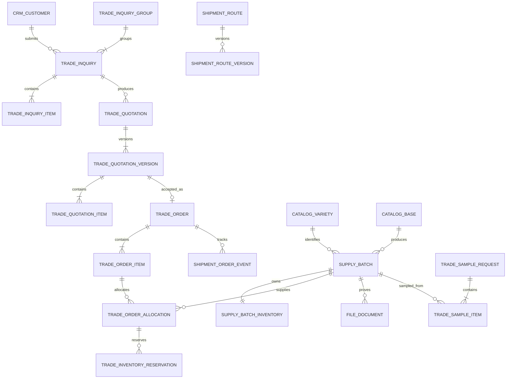

# 13 数据库与状态机设计

本文档把已确认的业务规则转换为 PostgreSQL 关系模型和状态流转约束，用于后端建表、Flyway 迁移、接口设计与测试。字段清单是 MVP 基线；迁移脚本建立时可补充技术字段，但不得改变本文定义的业务不变量。

| 项目 | 内容 |
|---|---|
| 版本 | v0.2 |
| 状态 | 技术设计草案，进入代码初始化前复核 |
| 适用范围 | PotatoLink MVP |

## 1. 设计目标

- 支撑商品薯与种薯同时经营，并确保每条交易明细只对应一个品种。
- 支撑游客询价、人工报价、报价审批、库存锁定、订单履约和批次文件授权。
- 精确库存、价格、成本和客户信息不进入公开接口。
- 报价版本、订单路线、审批条件和交易品种信息形成历史快照，不受基础资料后续修改影响。
- 关键状态变更可审计、可重试，并在并发操作下保持库存一致。
- 单企业自营是 MVP 边界，不提前引入多租户和第三方供应商模型。

## 2. 数据库通用约定

| 项目 | 约定 |
|---|---|
| 数据库 | PostgreSQL，具体版本在后端工程初始化时锁定 |
| 主键 | 19 位正整数雪花 ID；PostgreSQL 使用 `BIGINT`，Java 使用 `Long` |
| 业务编号 | 询价、报价、样品、订单和批次使用独立、唯一、可读编号 |
| 时间 | `TIMESTAMPTZ`；接口输出 ISO 8601 并带时区 |
| 金额 | `NUMERIC(18,2)`，禁止使用浮点类型；每条金额记录币种 |
| 重量 | 核心计算统一换算为千克，使用 `NUMERIC(18,3)`；单薯重量规格使用克，不使用斤、两；保留客户输入的国际单位 |
| 文本 | UTF-8，支持中文、俄文及后续其他语言 |
| 乐观锁 | 可编辑主数据和库存汇总表使用 `version_no` |
| 审计字段 | `created_at`、`created_by`、`updated_at`、`updated_by` |
| 逻辑删除 | 仅用于允许恢复的主数据；交易数据通过状态关闭，不直接删除 |
| 扩展字段 | `JSONB` 只保存快照或低频扩展信息，核心筛选字段必须独立建列 |

业务编号可以被客户看到，但不能代替身份认证。报价、订单和完整文件的访问仍须校验客户身份、限时令牌或二次验证码。

### 2.1 雪花 ID 约定

- 所有业务主表、明细表、关联表和审计表统一使用雪花 ID，不使用数据库自增主键或 UUID 主键。
- ID 必须为 19 位正整数，取值范围为 `1000000000000000000` 至 PostgreSQL 有符号 `BIGINT` 上限 `9223372036854775807`。
- 后端通过统一 `IdGenerator` 生成，初始实现采用 MyBatis-Plus `IdType.ASSIGN_ID`；业务代码不得自行拼接时间戳或随机数生成主键。
- 每个同时运行的后端实例必须配置唯一的 worker/datacenter 组合；开发、测试和生产使用不同配置，部署检查必须阻止重复节点编号上线。
- 生成器必须处理时钟回拨：小幅回拨等待恢复，超过允许阈值时拒绝生成并告警，禁止在回拨期间产生可能重复的 ID。
- Jackson、OpenAPI 和 TypeScript 将所有 ID 序列化为字符串；请求参数也按字符串接收并在后端校验后转换为 `Long`。
- OpenAPI ID 字段使用 `type: string`，并约束格式为 19 位正整数字符串。前端禁止对 ID 执行数值计算或转换为 JavaScript `number`。
- 雪花 ID 可能暴露大致生成顺序，不具备不可预测性。私有报价、订单和文件访问继续使用密码学安全随机令牌，并只保存令牌哈希。

## 3. 模块与表命名

数据库表使用小写蛇形命名，并按模块增加前缀：

| 模块 | 表前缀 | 主要职责 |
|---|---|---|
| 身份权限 | `iam_` | 内部用户、角色和权限 |
| 客户关系 | `crm_` | 客户、身份、负责人、跟进和同意记录 |
| 内容商品 | `catalog_` | 企业、基地、品种、多语言内容和媒体 |
| 供应库存 | `supply_` | 供应批次、库存、服务和公开状态 |
| 交易 | `trade_` | 询价、报价、样品、订单和库存占用 |
| 履约路线 | `shipment_` | 路线、路线版本、订单节点和运输附件 |
| 文件 | `file_` | 对象文件、批次资料、版本、授权和访问日志 |
| 通知 | `notify_` | 通知任务、模板和发送尝试 |
| 系统审计 | `sys_` | 字典、配置、审计、导出记录和事务事件 |

## 4. 核心关系



## 5. 身份与客户表

### 5.1 `iam_user`

内部账号，不与外部客户账号混用。

| 字段 | 类型/约束 | 说明 |
|---|---|---|
| `id` | BIGINT PK | 19 位雪花 ID，接口按字符串传输 |
| `username` | VARCHAR UNIQUE | 登录名 |
| `display_name` | VARCHAR | 显示名称 |
| `mobile` | VARCHAR NULL | 内部通知手机号 |
| `wechat_openid_cipher` | TEXT NULL | 加密保存的内部微信身份 |
| `status` | VARCHAR | `ACTIVE`、`DISABLED`、`LOCKED` |
| `last_login_at` | TIMESTAMPTZ NULL | 最近登录时间 |

配套表：`iam_role`、`iam_permission`、`iam_user_role`、`iam_role_permission`。成本、毛利、完整文件和导出权限必须独立配置，不能只依赖“是否管理员”。

### 5.1.1 `iam_auth_session`

内部登录使用密码学安全的随机访问令牌和刷新令牌，数据库只保存 SHA-256 哈希，不保存令牌明文。访问令牌默认 30 分钟，刷新令牌默认 7 天；刷新时撤销旧会话并轮换两个令牌，退出登录、账号禁用或安全事件均可提前撤销会话。

| 字段 | 类型/约束 | 说明 |
|---|---|---|
| `id` | BIGINT PK | 19 位雪花 ID |
| `user_id` | BIGINT FK | 内部账号 |
| `access_token_hash` | CHAR(64) UNIQUE | 访问令牌哈希 |
| `refresh_token_hash` | CHAR(64) UNIQUE | 刷新令牌哈希 |
| `access_expires_at` | TIMESTAMPTZ | 访问令牌过期时间 |
| `refresh_expires_at` | TIMESTAMPTZ | 刷新令牌过期时间 |
| `revoked_at` | TIMESTAMPTZ NULL | 会话撤销时间 |

### 5.2 `crm_customer`

| 字段 | 类型/约束 | 说明 |
|---|---|---|
| `id` | BIGINT PK | 19 位雪花 ID，接口按字符串传输 |
| `customer_no` | VARCHAR UNIQUE | 面向业务的客户编号 |
| `customer_type` | VARCHAR | `COMPANY` 或 `INDIVIDUAL` |
| `company_name` | VARCHAR NULL | 企业名称 |
| `contact_name` | VARCHAR | 联系人 |
| `country_code` | VARCHAR | 国家代码，俄罗斯客户默认为 `RU` |
| `region`、`city` | VARCHAR NULL | 地区和城市 |
| `preferred_locale` | VARCHAR | `zh-CN`、`ru-RU` 等 |
| `source_channel` | VARCHAR | 小程序、H5、销售代录等 |
| `owner_user_id` | BIGINT FK NULL | 当前主负责人 |
| `status` | VARCHAR | `LEAD`、`ACTIVE`、`INACTIVE`、`MERGED` |
| `merged_into_id` | BIGINT FK NULL | 重复客户合并目标 |

### 5.3 客户身份与联系方式

- `crm_customer_identity`：微信 `openid/unionid`、安全链接客户身份等；标识值加密或哈希保存。
- `crm_customer_contact`：手机、邮箱、Telegram；保存标准化值、掩码值、验证状态和是否首选。
- `crm_customer_assignment_history`：原负责人、新负责人、原因、操作人和生效时间。
- `crm_consent_record`：协议类型、版本、语言、同意渠道、时间和撤回时间。
- `crm_data_subject_request`：查询、更正、删除或撤回营销同意请求及处理结果。
- `crm_follow_up`：关联客户和询价，记录沟通方式、内容摘要、下次跟进时间及操作人。

用于检索的手机号和邮箱保存标准化哈希列；页面展示读取加密原值并按权限脱敏。日志和导出审计不得记录完整联系方式。

## 6. 内容、品种与媒体表

### 6.1 主表

- `catalog_company`：企业法律名称、对外简称、状态。
- `catalog_base`：基地、地区、公开面积口径、证据来源和发布状态。
- `catalog_variety`：品种代码、中文名称、别名、熟期、商品薯/种薯适用标记和发布状态。
- `catalog_localization`：实体类型、实体 ID、语言、内容版本、结构化内容、翻译状态和审核信息。
- `catalog_media_asset`：图片/视频用途、排序、版权或来源说明、关联文件和发布状态。

品种的天数、产量、干物质、淀粉和还原糖等数值，同时保存单位、来源、适用区域及条件。禁止仅保存一个脱离条件的数值。

### 6.2 翻译状态

`DRAFT`（未翻译）→ `PROOFREADING`（待校对）→ `BUSINESS_REVIEW`（待业务审核）→ `PUBLISHED`（已发布）。

中文源内容版本发生变化时，已发布俄文转为 `REVIEW_REQUIRED`。关键贸易字段未达到 `PUBLISHED` 时，不得用于正式报价、合同或批次证明输出。

## 7. 供应批次与库存表

### 7.1 `supply_batch`

| 字段 | 类型/约束 | 说明 |
|---|---|---|
| `id` | BIGINT PK | 19 位雪花 ID，接口按字符串传输 |
| `batch_no` | VARCHAR UNIQUE | 批次编号和二维码业务键 |
| `business_type` | VARCHAR | `COMMODITY` 或 `SEED` |
| `variety_id` | BIGINT FK | 一个批次只对应一个品种 |
| `base_id` | BIGINT FK | 生产或存储基地 |
| `crop_year` | SMALLINT | 年份 |
| `harvest_at` | DATE NULL | 实际或预计采收日期 |
| `available_from` | DATE NULL | 预计上市日期 |
| `public_supply_status` | VARCHAR | 人工维护的六种公开供应状态 |
| `quantity_visibility` | VARCHAR | `RANGE`、`STATUS_ONLY`、`HIDDEN` |
| `public_quantity_range_code` | VARCHAR NULL | 对应业务类型的公开区间 |
| `package_type_code` | VARCHAR | 默认 25 公斤网眼袋 |
| `package_weight_kg` | NUMERIC(10,3) | 单包装重量 |
| `order_moq_kg` | NUMERIC(18,3) | 批次级订单起订量覆盖值 |
| `line_moq_kg` | NUMERIC(18,3) | 单品种最低量覆盖值 |
| `allow_sample` | BOOLEAN | 是否允许样品 |
| `review_status` | VARCHAR | 批次审核状态 |
| `publish_status` | VARCHAR | 发布生命周期 |
| `version_no` | INTEGER | 乐观锁版本 |

商品薯规格、水洗状态、储藏状态等进入 `supply_commodity_profile`；种薯繁育级别、规格、发芽和储存条件进入 `supply_seed_profile`，两者与 `supply_batch` 一对一，且由约束保证只出现与 `business_type` 对应的扩展记录。

### 7.2 `supply_batch_inventory`

| 字段 | 类型/约束 | 说明 |
|---|---|---|
| `batch_id` | BIGINT PK/FK | 每批次一条库存汇总 |
| `on_hand_kg` | NUMERIC(18,3) | 当前实物可管理总量 |
| `temp_locked_kg` | NUMERIC(18,3) | 生效的临时锁定量 |
| `committed_kg` | NUMERIC(18,3) | 合同或定金确认后的正式占用量 |
| `fulfilled_kg` | NUMERIC(18,3) | 已出库或履约数量 |
| `version_no` | INTEGER | 并发控制版本 |

可售数量按 `on_hand_kg - temp_locked_kg - committed_kg` 计算，且必须大于或等于零。`fulfilled_kg` 用于对账，不重复进入可售数量公式；出库时同步减少 `on_hand_kg` 和相应正式占用量。

库存调整使用 `supply_inventory_ledger` 记录变动前后数量、变动类型、业务对象、幂等键、操作人和原因。禁止直接修改库存汇总而不写流水。

## 8. 询价表与状态机

### 8.1 `trade_inquiry`

商品薯和种薯的必填字段与后续审核不同，因此一张询价只保存一种 `business_type`。客户一次同时采购两类产品时，使用 `trade_inquiry_group` 关联两张询价，并在组级别保存同一主负责人，满足混合采购只设一名主负责人的规则。

| 字段 | 类型/约束 | 说明 |
|---|---|---|
| `id` | BIGINT PK | 19 位雪花 ID，接口按字符串传输 |
| `inquiry_no` | VARCHAR UNIQUE | 客户可见编号 |
| `inquiry_group_id` | BIGINT FK NULL | 同次混合采购或关联需求组 |
| `business_type` | VARCHAR | `COMMODITY` 或 `SEED` |
| `customer_id` | BIGINT FK | 提交客户 |
| `source_channel` | VARCHAR | 小程序、H5、销售代录等 |
| `status` | VARCHAR | 询价状态 |
| `owner_user_id` | BIGINT FK NULL | 主负责人 |
| `backup_user_id` | BIGINT FK NULL | 备用负责人 |
| `assigned_at` | TIMESTAMPTZ NULL | 分配时间 |
| `first_response_at` | TIMESTAMPTZ NULL | 首次有效响应 |
| `response_due_at` | TIMESTAMPTZ NULL | 2 小时响应目标 |
| `escalation_due_at` | TIMESTAMPTZ NULL | 4 小时升级目标 |
| `timeout_due_at` | TIMESTAMPTZ NULL | 24 小时超时目标 |
| `lost_reason_code` | VARCHAR NULL | 未成交原因 |
| `special_requirement` | BOOLEAN | 起订量不足等特殊需求 |

`trade_inquiry_item` 保存品种或“需要推荐”、用途、规格、处理方式、包装、数量公斤值、客户输入数量和单位。种薯扩展条件进入 `trade_seed_requirement`，与询价一对一。

### 8.2 询价状态

```text
PENDING_ASSIGNMENT
    → ASSIGNED
    → FOLLOWING
    → REQUIREMENT_CONFIRMED
    → QUOTING
    → QUOTED
    → WON
```

允许从 `ASSIGNED` 至 `QUOTED` 的任一未结束状态进入 `LOST`；无效或重复询价可进入 `CLOSED`。`LOST` 和 `CLOSED` 恢复时必须记录原因和操作人。

关键副作用：

- 创建后根据业务类型和老客户归属规则分配负责人。
- 第一次有效跟进写入 `first_response_at`，只写一次。
- 报价首版建立后至少进入 `QUOTING`；报价正式发送后进入 `QUOTED`。
- 关联报价被接受并创建订单后进入 `WON`。

## 9. 报价、版本与审批

### 9.1 表结构

- `trade_quotation`：报价逻辑主体、询价、客户、业务类型、当前版本号和总体状态。
- `trade_quotation_version`：版本号、币种、总金额、有效期、交付和责任说明、规则快照、路线参考、PDF 文件、状态和发布时间。
- `trade_quotation_item`：版本、品种、可选批次、规格、包装、数量、单价、金额和中俄文快照。
- `trade_quotation_approval`：版本、审批级别、触发原因、指导价/金额阈值快照、审批人、结果、意见和时间。
- `trade_secure_access`：报价或订单对象、令牌哈希、失效时间、撤销时间、访问范围和二次验证要求。

报价版本发布后不可更新业务字段。修改时复制为新版本，旧版本进入 `SUPERSEDED` 但继续保留 PDF、审批和访问记录。

### 9.2 报价版本状态

```text
DRAFT
  ├─无需审批→ APPROVED
  └─触发审批→ PENDING_APPROVAL → APPROVED
                              └→ REJECTED
APPROVED → SENT → ACCEPTED
                ├→ CUSTOMER_REJECTED
                ├→ REVISION_REQUESTED → SUPERSEDED
                └→ EXPIRED
```

规则：

- 低于指导价或总额达到配置阈值时必须审批；MVP 默认金额阈值为人民币 20 万元。
- 未达到 `APPROVED` 的版本不能发送；未达到 `SENT` 的版本不能由客户接受。
- 接受动作必须校验有效期，并使用幂等键防止重复创建订单。
- 同一报价逻辑主体只能有一个 `ACCEPTED` 版本。
- 商品薯默认有效 3 天，种薯默认 7 天；实际值保存在报价版本中。

## 10. 订单、批次分配与库存锁定

### 10.1 表结构

- `trade_order`：订单编号、已接受报价版本、客户、业务类型、币种、总金额、合同编号、状态和查询授权配置。
- `trade_order_item`：品种快照、规格、包装、数量、单价、金额及订单级起订量校验结果。
- `trade_order_allocation`：订单明细、供应批次和分配数量；M4 第一版一个明细同时只允许一个活动分配，释放后保留历史并允许重选批次，后续通过新迁移支持同时拆分多批次。
- `trade_inventory_reservation`：订单、分配、批次、数量、锁定阶段、失效时间、确认/释放时间和原因。
- `trade_contract_document`：订单、文件、合同版本、双方签署状态和归档时间。

订单必须复用已接受报价版本的客户、品种、价格、交付和责任快照，不允许从当前品种或路线主数据重新生成历史内容。

### 10.2 库存占用状态

```text
TEMP_LOCKED
    → COMMITTED
        → FULFILLED
    ├→ EXPIRED
    └→ RELEASED
```

- 客户接受报价后由订单自身的 `PENDING_LOCK` 状态表示待锁定任务，默认 2 个工作小时内处理；此时不创建库存占用记录，也不扣减可售库存。
- `TEMP_LOCKED`：销售确认批次和数量后生效，默认保留 24 小时，增加 `temp_locked_kg`。
- `COMMITTED`：合同或定金确认后转正式占用，原子地减少临时锁定并增加正式占用。
- `FULFILLED`：实际出库后减少 `on_hand_kg` 和 `committed_kg`，记录库存流水。
- `EXPIRED/RELEASED/REJECTED`：按当前阶段释放占用并保留原因，不删除记录。

### 10.3 并发事务规则

确认临时锁定时，后端必须在单一数据库事务中：

1. 按批次 ID 固定顺序锁定 `supply_batch_inventory` 行，降低多批次分配死锁风险。
2. 重新计算每个批次可售量，不信任前端提交的库存结果。
3. 校验所有批次数量足够后，一次性更新库存汇总、占用记录和库存流水。
4. 写入事务事件；任一步失败则整体回滚。

超时释放任务也使用相同的行锁和幂等规则。数据库约束保证所有库存数量非负；业务服务保证同一占用记录只能执行一次状态副作用。

### 10.4 订单状态

```text
PENDING_LOCK
  → TEMP_LOCKED
  → CONFIRMED
  → FULFILLING
  → SHIPPED
  → DELIVERED
  → COMPLETED
```

`TEMP_LOCKED` 即表示等待合同或定金确认。`PENDING_LOCK` 至 `FULFILLING` 可因业务或合规问题进入 `SUSPENDED`；发运前订单可进入 `CANCELLED`，但必须先按事务释放未履约库存。详细物流步骤不膨胀订单主状态，统一记录在订单事件中。

## 11. 样品表与状态机

`trade_sample_request` 保存客户、询价、业务类型、货款、运费、支付状态、抵扣截止日期、关联订单和总体状态。`trade_sample_item` 每行只关联一个品种、一个真实批次和 25 公斤样品量，一次申请最多 3 行。`trade_sample_review` 分别记录销售审核、种薯质量审核和跨境合规检查。

```text
PENDING_REVIEW
  → APPROVED
  → PENDING_PAYMENT
  → READY_TO_DISPATCH
  → IN_TRANSIT
  → RECEIVED
  → FOLLOWED_UP
  → CONVERTED_TO_ORDER
```

审核不通过进入 `REJECTED`；客户放弃或无法寄送进入 `CANCELLED`。跨境合规检查未通过时不得进入 `READY_TO_DISPATCH`。进入待发出前通过 `trade_inventory_reservation` 建立样品临时锁定；实际发出时扣减实物库存并记录 `SAMPLE_OUTBOUND` 流水，取消或超时则释放。签收后分别产生 3 天和 7 天回访任务；30 天内转正式订单可抵扣样品货款，运费不抵扣。

## 12. 路线、履约和订单事件

- `shipment_route`：路线业务标识、名称、启用状态和当前版本。
- `shipment_route_version`：出发基地、国内交接点、出境口岸、过境国家、目的国家/城市、责任方、责任截止点、参考时间和生效时间。
- `shipment_order_route_snapshot`：订单创建时复制路线版本及报价约定，后续路线字典变化不回写历史订单。
- `shipment_order_event`：节点类型、状态、实际/预计时间、中俄说明、是否客户可见、车辆信息和操作人。
- `shipment_event_attachment`：订单节点与文件的关联。

霍尔果斯是首个启用口岸，但所有代码引用路线或口岸字典，不使用写死名称。默认节点模板为基地备货、客户提货或佳秀安排国内运输、国内运输中、到达口岸、单证检查、待出境、已出境、跨境运输中、到达目的地和客户签收。

## 13. 文件、证书与访问控制

### 13.1 表结构

- `file_object`：存储桶、对象键、原文件名、MIME、大小、哈希、加密状态和上传人。
- `file_document`：业务对象、文件类型、签发机构、签发/到期时间、审核状态、访问级别和当前版本。
- `file_document_version`：原文件、脱敏文件、版本、替换来源、撤销状态、水印策略和审核信息。
- `file_access_grant`：客户、报价/订单、文件、权限范围、有效期和撤销时间。
- `file_access_log`：访问客户、文件版本、动作、结果、时间和必要的安全上下文。

### 13.2 文件状态

```text
NOT_SUBMITTED → PENDING_REVIEW → VERIFIED
                              └→ REJECTED
VERIFIED → EXPIRED | REPLACED | REVOKED
```

到期前 30 天创建提醒。`EXPIRED`、`REPLACED`、`REVOKED` 和 `REJECTED` 停止有效展示，但不删除历史版本。植物检疫证书仅能向关联订单客户授权。

## 14. 通知、任务与可靠事件

- `notify_template`：渠道、语言、模板版本和启用状态。
- `notify_task`：业务对象、接收人、渠道、计划发送时间、状态和幂等键。
- `notify_attempt`：每次尝试的请求摘要、时间、结果、失败原因和重试序号。
- `sys_outbox_event`：与业务事务同时写入的事件，提交后由后台任务可靠处理通知、PDF、超时和提醒。
- `sys_job_lock`：避免多个实例重复执行报价过期、库存释放和文件到期任务。

当前 M5 第一阶段以 `notify_task` 的唯一去重键承担通知专用事务 Outbox：询价、报价、订单更新与通知任务在同一数据库事务写入。`notify_attempt` 预留发送尝试记录；在渠道身份和服务配置就绪前，任务保持 `PENDING`，不得标记为已送达。通用 `sys_outbox_event` 留待 PDF 和其他异步消费者接入时建设。

通知状态为 `PENDING`、`PROCESSING`、`SENT`、`FAILED_RETRYABLE`、`FAILED_FINAL`、`CANCELLED`。业务交易不能因为微信或邮件临时失败而回滚；失败进入重试和人工处理队列。

## 15. 系统配置、审计和成本

- `sys_dictionary`、`sys_dictionary_item`：口岸、包装、繁育级别、公开数量区间、未成交原因等可配置字典。
- `sys_business_rule`：起订量、响应时限、报价有效期、审批阈值和锁定时限；保存生效版本。
- `sys_audit_log`：操作人、动作、对象、结果、时间、变更摘要和请求追踪 ID。
- `sys_export_audit`：导出人、用途、筛选条件、字段、记录数、文件和结果。
- `trade_cost_record`：关联批次/报价/订单的成本版本、费用组成和毛利，仅授权角色可访问。

审计变更摘要不得保存密码、令牌原文、验证码、完整联系方式或文件签名地址。

## 16. 关键数据库约束

首批迁移至少实现以下约束：

1. 批次、询价、报价、样品和订单业务编号全局唯一。
2. 所有主键必须是 19 位正整数雪花 ID；所有外键使用相同的 `BIGINT` 类型。
3. 数量、重量、单价、金额、库存和锁定值不得为负。
4. 询价、报价、订单和样品明细必须至少一条。
5. 一个明细只能关联一个品种，不允许用单行表达混合品种。
6. 订单分配批次的品种和业务类型必须与订单明细一致；M4 第一版每条订单明细恰好分配一个批次，由业务层校验并用集成测试覆盖。
7. 报价版本号在同一报价内唯一；已发送版本的业务字段不可更新。
8. 一个报价只能存在一个被接受的版本；一个报价版本最多生成一个有效订单。
9. 库存可售量不得小于零；每个生效库存副作用必须有唯一幂等键和流水。
10. 临时锁定必须具有到期时间；正式占用不得设置自动到期。
11. 订单路线、报价规则、产品名称、规格和价格使用快照保存。
12. 游客不可获得精确库存、内部价格、成本、未脱敏文件和客户交易数据。
13. 删除客户前必须执行保存期限、交易留存和匿名化规则，不能级联删除交易记录。

跨表、跨行的复杂不变量由领域服务在事务中保证，并通过数据库检查约束、唯一索引和集成测试形成多层保护。

## 17. 主要索引

- 客户：标准化联系方式哈希、企业名称、负责人和状态。
- 批次：批次编号、业务类型 + 品种 + 发布状态、上市时间、文件到期时间。
- 询价：询价编号、负责人 + 状态、响应/升级/超时时间、客户 + 创建时间。
- 报价：报价编号、询价、客户、版本状态、有效期。
- 库存占用：批次 + 状态、订单 + 状态、临时锁定到期时间。
- 订单：订单编号、客户 + 状态、报价版本、创建时间。
- 通知与事件：状态 + 计划处理时间、幂等键。
- 审计：对象类型 + 对象 ID、操作人 + 时间。

索引在真实查询和执行计划验证后调整，不为低选择性字段盲目建立单列索引。

## 18. 首批迁移顺序

```text
V001  扩展、通用审计字段和系统字典
V002  IAM 用户、角色和权限
V003  客户、联系方式、负责人和同意记录
V004  企业、基地、品种、多语言和媒体
V005  供应批次、扩展属性、库存汇总和流水
V006  询价、明细、种薯需求和跟进
V007  报价、版本、明细、审批和安全访问
V008  报价客户反馈和操作审计
V009  内部账号和认证会话
V010  批次资料、文件授权和公开溯源
V011  重量规格统一为公制表达
V012  订单、明细、单批次分配、库存占用、路线快照、履约节点和订单安全访问
后续迁移  通知、Outbox、任务锁、成本、导出审计和多批次拆分能力
```

Flyway 迁移一旦进入共享环境不得修改原文件，只能新增更高版本迁移。

## 19. 必须覆盖的集成测试

1. 两个请求同时锁定同一批次时，不能产生负库存或超卖。
2. 多批次订单中任一批次数量不足时，整次锁定全部回滚。
3. 临时锁定到期只释放一次，并生成库存流水和审计记录。
4. 临时锁定转正式占用时，总占用量不重复增加。
5. 已发送报价不可原地修改，新报价内容形成新版本。
6. 过期报价不能接受，重复接受不能创建第二个订单。
7. 起订量不足的询价可提交特殊需求，但不能自动进入普通报价流程。
8. 不同品种可在同一订单中形成不同明细，但不能分配到错误品种批次。
9. 游客、非关联客户和关联订单客户读取同一文件时得到不同授权结果。
10. 中文关键内容更新后，已发布俄文自动进入重新审核状态。
11. 订单取消时释放所有未履约占用，已履约流水不被反向删除。
12. 通知发送失败不回滚询价、报价接受或订单状态事务。
13. 样品待发出时占用对应批次库存，发出只扣减一次，取消或超时正确释放。
14. 雪花 ID 在并发、跨节点和模拟时钟回拨测试中保持 19 位、正数且不重复；接口序列化后仍为字符串。

## 20. 进入编码前的输出

后端工程初始化时，根据本文生成：

- 按仓库现有版本顺序新增 Flyway 迁移及必要索引，不修改已经进入共享环境的历史迁移。
- Java 领域枚举、状态转换服务和数据库实体。
- 库存锁定与释放的事务集成测试。
- OpenAPI 公共模型、管理模型和错误码。
- 仅含演示数据的本地初始化脚本。

如代码实现需要偏离本文模型，先在文档仓库记录原因和影响，再修改迁移与接口，避免前后端依据不一致。

第一版接口分组、请求响应规则和错误码见 [API 契约与错误码](14-api-contract-and-error-codes.md)，机器可读草案位于 `api/openapi-v1.yaml`。
